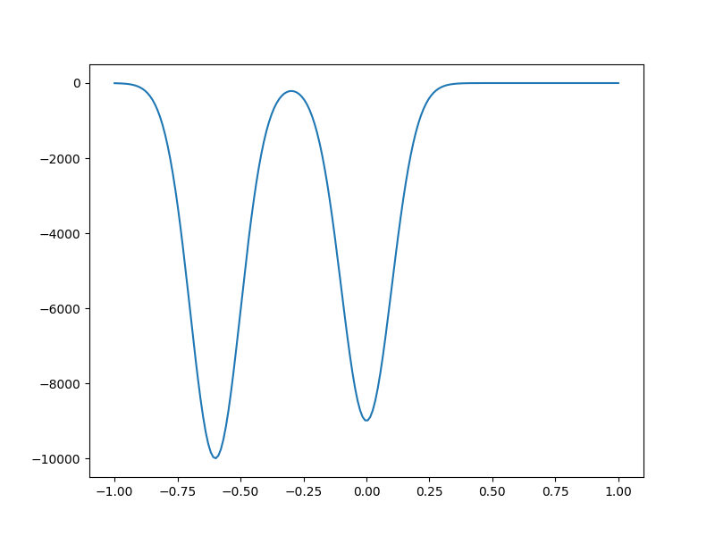

# Schrodinger PyTorch

This project is a first look at simulating the Schrodinger equation using PyTorch to improve speeds dramatically using the GPU.

This project hopes to expand to include multidimensional (starting with 3 and moving up from there) solutions, although computation complexity and memory requirements are likely to be a limiting factor.

The overall goal of this investigation is to use the Schrodinger equation and an energy potential to simulate an attractor space that can explore many orbits at once - classically requiring a great deal of computation as each orbit would be simulated separately.

## Time Dependent Solutions

Under `schrodingerUtils.physics` the class `TimeDependentSchrodingerSolver` allows for an initial wave function to be iterated over time given a potential. `timeDependentSolution.ipynb` shows how this may be implemented, as well as providing some code to produce an animation of the wavefunction.

Given the potential:

We found the wavefunction evolves like so:

Note the numerical instability at times (high frequency noise in the wavefunction), and the lack of convergence of the wave function. This is moderately disappointing for our final application, but is still interesting physically.

## References

This project is inspired by: [Luke Polson](https://github.com/lukepolson/youtube_channel/blob/3642cdd80f9200a5db4e622a3fe2c1a8f6868ecd/Python%20GPU/schrodinger.ipynb)